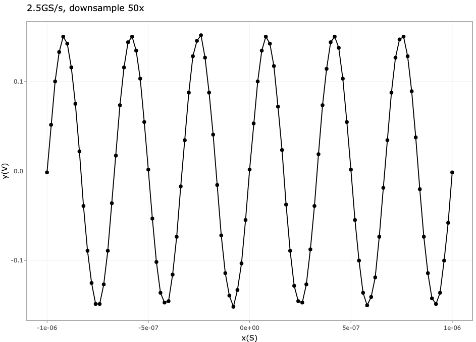
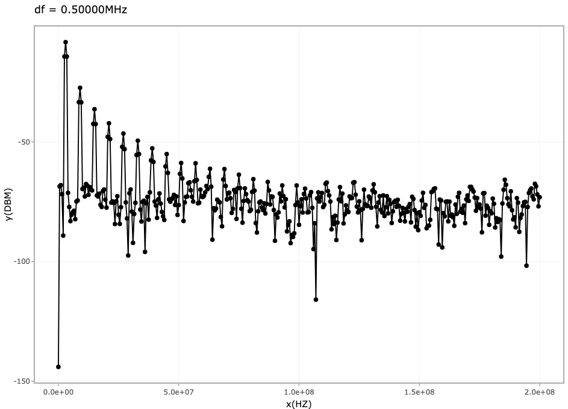

# Read Trc

Small R script to decode binary waveform (.trc file) saved from Lecroy Scope

Require packages

-   tidyverse
-   plotly
-   R6

# Usage

``` r
trc <- Trc$new()
trc$decode("01_data/C1--Trace--00000.trc")
trc$print()
trc$plot()
trc$to_tsv()
```

`trc$print()` will show meta data

``` r
           trc_file : 01_data/C1--Trace--00000.trc
      TEMPLATE_NAME : LECROY_2_3
          COMM_TYPE : word
         COMM_ORDER : Lo First
   WAVE_DESC_LENGTH : 346
   USER_TEXT_LENGTH : 0
    TRIG_TIME_ARRAY : 0
     RIS_TIME_ARRAY : 0
       WAVE_ARRAY_1 : 10004
       WAVE_ARRAY_2 : 0
    INSTRUMENT_NAME : LECROYHDO4104
  INSTRUMENT_NUMBER : 15
        TRACE_LABEL :
   WAVE_ARRAY_COUNT : 5002
  POINTS_PER_SCREEN : 5000
        FIRST_VALID : 0
         LAST_VALID : 5001
        FIRST_POINT : 0
    SPARSING_FACTOR : 1
         SEGMENT_NO : 0
     SUBARRAY_COUNT : 1
     SWEEPS_PER_ACQ : 1
    POINTS_PER_PAIR : 0
        PAIR_OFFSET : 0
      VERTICAL_GAIN : 6.10351980867563e-06
    VERTICAL_OFFSET : 0
          MAX_VALUE : 32512
          MIN_VALUE : -32768
       NOMINAL_BITS : 8
 NOM_SUBARRAY_COUNT : 1
HORIZONTAL_INTERVAL : 4.00000005340573e-10
  HORIZONTAL_OFFSET : -1.00027057941612e-06
       PIXEL_OFFSET : -1e-06
           VERTUNIT : V
            HORUNIT : S
  HORIZ_UNCERTAINTY : 9.99999996004197e-13
       TRIGGER_TIME : 2024-08-26 20:40:17
       ACQ_DURATION : 0
     CA_RECORD_TYPE : single_sweep
    PROCESSING_DONE : no_processing
         RIS_SWEEPS : 1
          TIME_BASE : 200_ns/div
  VERTICAL_COUPLING : DC_1MOhm
  PROBE_ATTENUATION : 1
FIXED_VERTICAL_GAIN : 50_mV/div
   BAND_WIDTH_LIMIT : off
   VERTICAL_VERNIER : 1
ACQ_VERTICAL_OFFSET : 0
        WAVE_SOURCE : CHANNEL_1
```

`trc$plot()` will plot the wfm, by default, downsample 50x for faster plot
two sample images show a wfm and a fft





`trc$to_tsv()` will export to a txt file separated by tab
